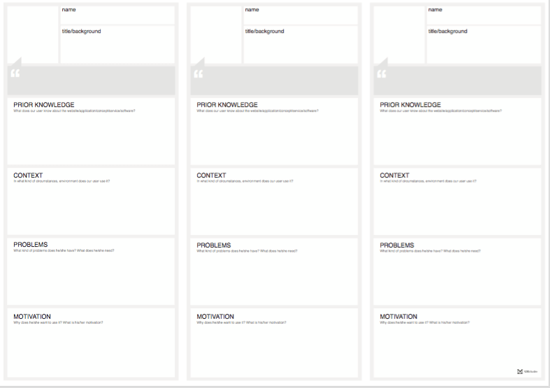

# Workshop UX

## Warm up 
### Prison Cake 
* **What do you need:** Paper, pen, a team
* **Duration:** 5 min + discussion
* **What to do:** A person you care a lot about is unjustly in prison. You want to break out this person, the only way to do this is by means of a cake. This cake is 20 cm in diameters and 4 cm high, in which you can hide tools to break out the person in question. Make a list of tools to break this person out. 

## Information

* [Powerpoint](https://docs.google.com/presentation/d/1UcZbbT5Dk61B8mKW4F1opTla-0G6IKnMQTY0jGAPT4o/edit?usp=sharing)
* [Don't Make me think - Steve Krug](http://www.scottsdevelopers.com/dont-make-me-think-revisited.pdf)
* [Killer UX Design - Jodie Moule](https://www.slideshare.net/Gnasvipzem/killer-ux-design-free-book)

## Exercise 1
### Wireframing your favorite website
* **What do you need:** Paper, pen, (a team)
* **Duration:** ± 20 min
* **What to do:** Take 3 of your favorite websites or apps and wireframe these. Then compare these 2 websites/apps. What do they have in common? What are the differences?

## Exercise 2 **(extra)**
### Wireframing a bad website
* **What do you need:** Paper, pen
* **Duration:** ± 15 min
* **What to do:** Look for a realy bad website or app, wireframe this. What has to change? What is already good? Can you improve it?

## Exercise 3
### Personas of your favorite website
* **What do you need:** Paper, pen, (a team)
* **Duration:** ± 20 min
* **What to do:** Take a look at your favorite website or app. can you make a persona for it? Who is it? Is it you? or someone else, ask them some questions. 
If you are having trouble making a persona use the canvas.

**For clarification purposes:**
1. **Prior knowledge**
    - What does our user know about the website/app/software?
2. **Context**
    - In what kind of circumstances/ environment does our user use it?
3. **Problems**
    - What kind of problems does he/she have? What does he/she read?
4. **Motivation**
    - Why does he/she wants to use it? what is his/her motivation?

## Exercise 4
### Personas of the BeCode website
* **What do you need:** Paper, pen, (a team)
* **Duration:** ± 20 min
* **What to do:** Take a look at the BeCode website and try to make a persona for it. You can use the same canvas like the previous exercise.

## Exercise 5
### BeCode Website
* **What do you need:** Paper, pen, (a team)
* **Duration:** ± 40 min
* **What to do:** Work with the persona you created, try to start from a wireframe and proceed to a simple mockup for the BeCode website.

